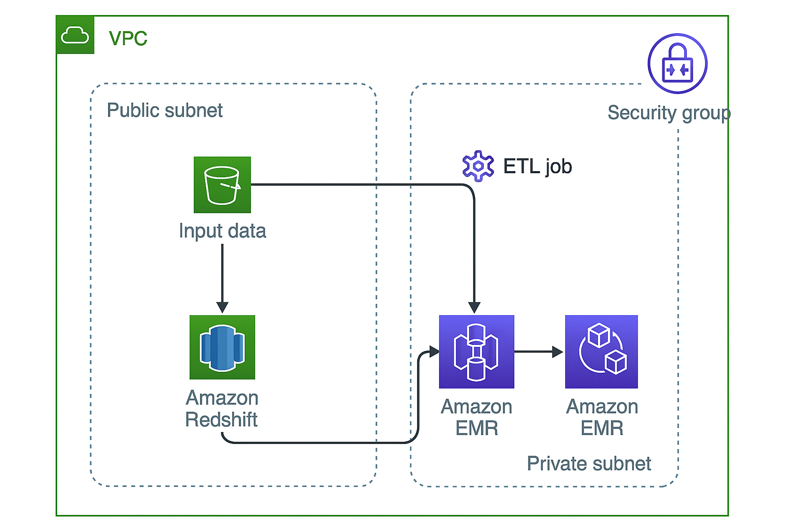

# AWS Redshift + EMR Terraform Project

This Terraform project provisions an AWS infrastructure with:
- A VPC with public/private subnets
- Security groups
- An EMR cluster to process data
- A Redshift cluster as a data warehouse
- An S3 bucket for data storage
- IAM roles/policies for necessary access
- A simple PySpark ETL job that reads from S3 and writes to Redshift

---

## 🔧 Architecture Overview




## 🗂️ Project Structure

```bash
.
├── diagram/
│   └── AWS_architecture_diagram.png      # System architecture image
├── scripts/
│   └── etl_s3_to_redshift.py             # PySpark ETL job
├── terraform/
│   ├── emr.tf                            # EMR cluster configuration
│   ├── iam.tf                            # IAM roles and policies
│   ├── main.tf                           # Terraform main file
│   ├── outputs.tf                        # Output variables
│   ├── redshift.tf                       # Redshift cluster config
│   ├── s3.tf                             # S3 bucket setup
│   ├── variables.tf                      # Input variables
│   └── vpc.tf                            # Networking setup (VPC, subnets, etc.)
├── .gitattributes
└── README.md                             # This file
```
## 🚀 Deployment Instructions

### 1. Prerequisites
- Terraform ≥ 1.3
- AWS CLI with credentials configured (`~/.aws/credentials`)
- Python + PySpark (for local testing ETL)

### 2. Clone the Repo
```bash
git clone https://github.com/your-org/terraform-aws-redshift-emr.git
cd terraform-aws-redshift-emr
```

## 🚀 Deployment Instructions

### 3. Initialize Terraform

Initialize the project and download required provider plugins:

```bash
terraform init
```

### 4. Plan the Infrastructure
Generate an execution plan to review the resources Terraform will create or change:

```bash
terraform plan -out=tfplan
```

### 5. Apply the Plan
Apply the infrastructure changes and create the resources:

```bash
terraform apply tfplan
```


 ### Teardown (Destroy Resources)
To clean up all infrastructure and avoid charges:

```bash
terraform destroy
```
